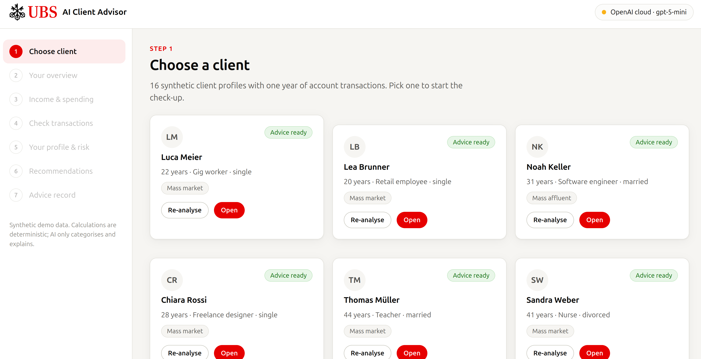
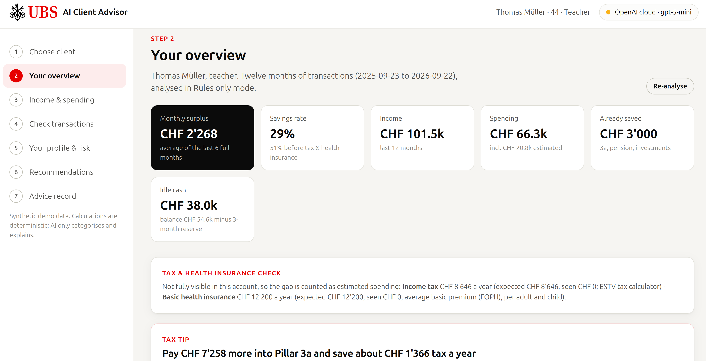
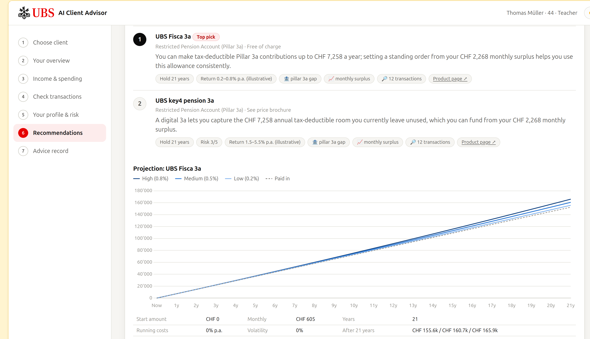

#DISCLAIMER
This is a **demo project** for the UBS Swiss AI Challenge. It is not a UBS product, nor is it financial advice. It is not intended for production use, and it is not a substitute for professional financial advice. The project is provided "as is" without any warranties or guarantees of accuracy, completeness, or reliability. Users should exercise caution and seek professional advice before making any financial decisions based on the information provided in this demo.


# UBS-Swiss-AI-Challenge 22nd September 2026

**AI Client Advisor** — a client-facing financial check-up. It reads twelve months of account
transactions, works out where the money goes, finds the gaps (unused Pillar 3a allowance, idle
cash, foreign-currency fees, an affordable mortgage) and recommends UBS products that pass a
FinSA suitability check — with the evidence, the projection and the assumptions shown next to
every recommendation.

The guiding rule of the whole build:

> **The AI categorises and explains. Deterministic code does all the maths, the eligibility
> checks and the compliance gating.**

That means results are reproducible and testable, the numbers are defensible, and the model
cannot invent a product: the ranking step is constrained to an enum of catalog product IDs and
its output is validated against the catalog before anything is shown.



---

## Quick start

```bash
./run.sh                 # creates .venv on first run, installs deps, serves the app
```

Then open **http://localhost:8000**. Nothing else is required — no Docker, no database server,
no API key. On first launch the app asks how your data should be processed; choose
**"Rules only"** and the whole demo runs offline.

```bash
HOST=0.0.0.0 PORT=8080 ./run.sh    # if you need it on another interface/port
```

Developed on Python 3.12. State (SQLite DB, caches) lands in `var/app.db` and is git-ignored,
so deleting `var/` resets the demo.

---

## Data processing modes

The first screen is a gate: no transaction is read before the user has chosen how their data is
handled. This is the answer to the banking-secrecy question — the choice is explicit, visible in
the top-right badge at all times, and recorded in the event log.

| Mode | What happens | Data leaves the machine? |
|---|---|---|
| **`local`** (default) | An OpenAI-compatible endpoint hosted in Switzerland (Ollama, vLLM, …) via `LOCAL_LLM_BASE_URL`. If none is configured, the AI steps fall back to the deterministic rules. | No |
| **`openai`** | OpenAI API; key from `.env` or `api-key.sk`. Transaction descriptions are sent to OpenAI. | Yes |
| **`off`** | Rules only, LLM never called. | No |

Every LLM call — provider, model, prompt version, input hash, tokens, latency, cost in CHF — is
written to the `llm_audit` table and surfaced in the advice record. A per-run spend cap
(`OPENAI_MAX_SPEND_PER_RUN_CHF`, default CHF 1.00) is enforced in code; when it is hit, the run
degrades to rules instead of failing.

### Configuration

```bash
cp .env.example .env     # optional: only needed for the openai / local-LLM modes
```

`api-key.sk` and `.env` are git-ignored and must never be committed.

---

## The client journey

Seven steps, matching the sidebar:

| # | Step | What it does |
|---|---|---|
| 1 | **Choose client** | 16 synthetic personas (ages 20 to 71, gig worker to UHNW), or upload your own transaction CSV |
| 2 | **Your overview** | Surplus, savings rate, income, spending, idle cash, detected signals with drill-down to the transactions that triggered them |
| 3 | **Income & spending** | Monthly stacked spending by category, income vs. spending, recurring flows |
| 4 | **Check transactions** | Every transaction with its category, confidence and who classified it; low-confidence rows flagged "needs review" and manually overridable |
| 5 | **Your profile & risk** | Profile completion, risk questionnaire, knowledge & experience check, FinSA notice + acknowledgement |
| 6 | **Recommendations** | Ranked product baskets with rationale, holding period, projection chart and tax saved |
| 7 | **Advice record** | The whole run as a PDF, including the audit trail |



---

## How it works

### 1. Ingest
`app/ingest/` loads the persona CSV (`date, description, category, amount, currency, balance`)
against a Pydantic schema and fails loudly with a readable message on a missing or malformed
column. Counterparty names are normalised (`MIGROS ZH 1234` → `Migros`), and each transaction
gets a stable ID derived from its content.

### 2. Classify
`app/classify/` maps every transaction onto a fixed taxonomy of ~40 categories (salary, bonus,
pension income, rent, mortgage interest, childcare, health insurance, FX spend, Pillar 3a …).

- A rule-based pre-classifier handles the obvious cases first, which keeps the LLM cost near zero.
- What is left goes to the LLM in batches of 50 using **structured outputs** with a fixed JSON
  schema; the category is an enum, so an unknown label cannot come back.
- Results are cached by transaction hash — re-runs are free and deterministic.
- Anything below the confidence threshold (0.70) is flagged for review in step 4.

### 3. Signals (deterministic, with evidence)
`app/features/signals.py` runs 17 detectors. Each one stores the IDs of the transactions that
triggered it, and that evidence is shown in the UI and printed in the advice record.

| | |
|---|---|
| `recurring_income` | Same payer, periodic interval (±3 days), low amount variance |
| `monthly_surplus` | Income − spending, per month and as a 6-month trailing average |
| `spending_exceeds_income` | Structural deficit |
| `idle_cash` | Balance above 3 months of spending |
| `foreign_spend` | Share and volume of non-CHF spending, plus estimated FX fees paid |
| `recurring_rent` | Regular payment to a landlord — a mortgage prospect |
| `family` | Daycare, school and child-related payments |
| `pillar_3a_gap` | Employment income present, 3a contributions below the cap |
| `salary_jump` | Salary up more than 10% month over month |
| `new_employer` | Change of salary payer |
| `move` | New landlord, moving company, new utility providers |
| `debt_stress` | Repeated consumer-debt repayments and penalty fees |
| `existing_mortgage` | Mortgage interest paid — refinancing prospect |
| `external_investments` | Money going to a competitor custody account |
| `high_net_worth` | Income/assets above the segment threshold |
| `self_employed` | Self-employment income, no pension fund |
| `retired` | AHV / pension-fund income |

A "tax & health insurance check" runs alongside: if income tax or the basic (KVG) premium is not
visible in the account, the expected annual amount is added as estimated spending, so surplus
and savings rate are not overstated. That is the difference between the 51% and 29% savings rate
in the screenshot above.

### 4. Tax and Pillar 3a
`app/tax/` calls the JSON API behind the official **ESTV tax calculator**
(`swisstaxcalculator.estv.admin.ch`), caching every response in SQLite by payload hash. If ESTV
is unreachable, it falls back to pre-computed tables in `config/tax_tables.json`, and the source
used is always stated in the UI. Output: the recommended annual 3a contribution, tax saved per
year and cumulatively over the holding period, and retroactive buy-backs for gap years (possible
from 2025).

### 5. FinSA suitability gate
`app/suitability/` derives **risk capacity** from income, surplus, assets and signals, and
**risk tolerance** from the questionnaire; the two combine into a risk profile (1 Conservative →
5 Dynamic) and a horizon. `check_product()` then runs the suitability and appropriateness checks
per product — risk class, knowledge level, minimum horizon, income and credit conditions.

Nothing is recommended before the questionnaire is complete and the FinSA notice has been
acknowledged; the acknowledgement is stored with the notice hash and a timestamp, and it is
invalidated if the answers change afterwards. Products that fail the gate are **hidden with a
stated reason**, which is listed in the advice record — not silently dropped.

### 6. Product mapping and ranking
`config/product_rules.yaml` holds 17 rules mapping signals to product candidates (no 3a → 3a
products; idle cash + surplus → funds and investing; debt stress → a budget-control card rather
than more credit; rent + stable salary + affordability → mortgage). Candidates pass through the
gate, and the survivors are ranked — by the LLM when one is available, deterministically
otherwise — into baskets: **Pillar 3a, Investment, Savings, Cards, FX, Mortgage & credit,
Everyday banking**.

The catalog is `data/ubs_products_with_risk.csv` (55 UBS products with source URLs);
`config/products.yaml` adds what the CSV does not carry — basket, risk class, knowledge
requirement, minimum horizon, eligibility and illustrative return assumptions. The loader fails
if the two disagree.

### 7. Projections
`app/projection/` shows low / medium / high expected-return scenarios, funded by the detected
surplus and idle cash, plus a seeded Monte Carlo 10th–90th percentile band for products that
carry a volatility assumption (a 3a savings account has none, so it gets scenario lines only). Running costs are
deducted from returns, and start amount, monthly contribution, horizon, costs and volatility are
printed under every chart. **The return assumptions are illustrative demo figures, not UBS
figures**, and the UI says so.



### 8. Advice record and audit trail
`GET /api/clients/{id}/report.pdf` builds a nine-section PDF: profile, key figures, signals with
evidence, Pillar 3a and tax, suitability and appropriateness results, recommended products with
rationale, products not shown and why, projections with assumptions, and the LLM audit trail
(model, prompt version, cost). Alongside it, the `events` table records every state change —
mode chosen, analysis completed, classification overridden, notice acknowledged, record
generated.

---

## Architecture

Deliberately small: one process, one file of state, no build step.

```
./run.sh
 └── uvicorn app.main:app                  :8000
      ├── app/            FastAPI + Pydantic v2, in-process threaded job runner
      ├── var/app.db      SQLite: runs, caches, questionnaires, acks, llm_audit, events
      ├── static/         vanilla HTML/CSS/JS + bundled Chart.js (no npm, no CDN)
      ├── config/         every business number lives here, never in code
      └── data/           16 persona CSVs + the UBS product catalog
```

| Path | Responsibility |
|---|---|
| `app/ingest/` | CSV loading, schema validation, normalisation |
| `app/classify/` | Taxonomy, rule pre-classifier, LLM classification with caching |
| `app/features/` | Cash-flow aggregation, profile derivation, the 17 signal detectors |
| `app/tax/` | ESTV client, tax tables, Pillar 3a planning |
| `app/suitability/` | Questionnaire, risk profiling, FinSA product gate |
| `app/recommend/` | Rule engine, LLM ranking with schema validation, mortgage affordability |
| `app/projection/` | Scenario and Monte Carlo projections |
| `app/reporting/` | PDF advice record |
| `app/llm/` | One client for both providers: structured outputs, spend cap, audit |
| `app/pipeline.py` | Orchestration of `analyse()` and `recommend()` |
| `config/settings.yaml` | Thresholds, caps, pricing, 3a limits, mortgage rules — all of it |

### HTTP API

| Method | Path | |
|---|---|---|
| `GET` | `/api/status` | mode, availability, catalog size |
| `POST` | `/api/mode` | choose `local` / `openai` / `off` |
| `GET` | `/api/clients` | personas + last run |
| `POST` | `/api/clients/upload` | upload a transaction CSV |
| `POST` | `/api/clients/{id}/analyse` | start analysis (returns a job ID) |
| `GET` | `/api/jobs/{job_id}` | progress messages |
| `GET` | `/api/clients/{id}/analysis` | KPIs, months, flows, signals, tax plan |
| `GET` | `/api/clients/{id}/transactions` | classified transactions |
| `POST` | `/api/clients/{id}/transactions/{txn}/override` | correct a category |
| `GET`/`POST` | `/api/clients/{id}/suitability` | questionnaire + risk result |
| `POST` | `/api/clients/{id}/acknowledge` | record the FinSA acknowledgement |
| `POST` | `/api/clients/{id}/recommend` | rank and project (returns a job ID) |
| `GET` | `/api/clients/{id}/recommendations` | baskets, hidden products, projections |
| `GET` | `/api/clients/{id}/report.pdf` | advice record |
| `GET` | `/api/clients/{id}/audit` | LLM calls and events |

---

## Data

All transaction data is **synthetic**. `data/personas/` holds 16 made-up clients aged 20 to 71 and spanning the
segments — gig worker, retail employee, software engineer, freelancer, teacher, nurse,
contractor, accountant, retirees, mass affluent through UHNW, and two with negative or
low net worth — each with one year of transactions. No real client data is used anywhere.

The product catalog was compiled from public ubs.com pages; every row carries its source URL.

---

## Status and limitations

- **Return figures are illustrative.** They are demo assumptions in `config/products.yaml`, not
  UBS performance data, and are labelled as such wherever they appear.
- **Tax figures are estimates.** ESTV gives a good federal/cantonal/municipal figure, but the app
  infers gross income from credited salary (`net_to_gross_salary: 0.88`) and does not model
  deductions beyond 3a.
- **2026 statutory values need a yearly check** — the 3a caps, the BVG entry threshold and the
  average health premium are marked `verify` in `config/settings.yaml`.
- **No automated tests yet.** `tests/` is scaffolded (`fixtures/`, `golden/`, `eval/`) but empty;
  the signal detectors, tax calculation, suitability gate and projections are the parts that most
  need unit and golden-file coverage, and an eval set of hand-labelled transactions would put a
  number on classification accuracy.
- Single-process SQLite, in-memory job registry: fine for a demo, not for concurrent users.
